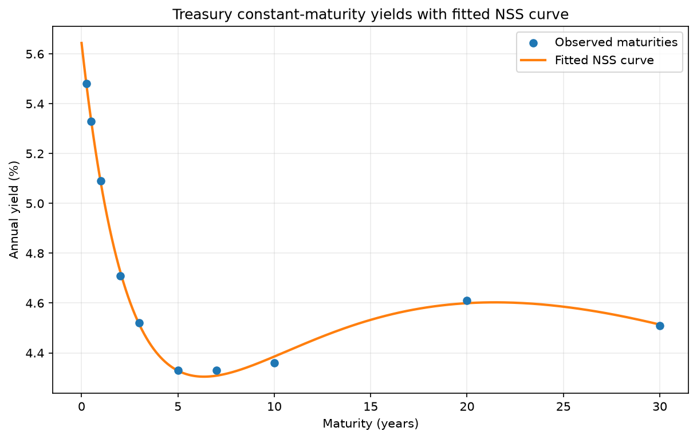
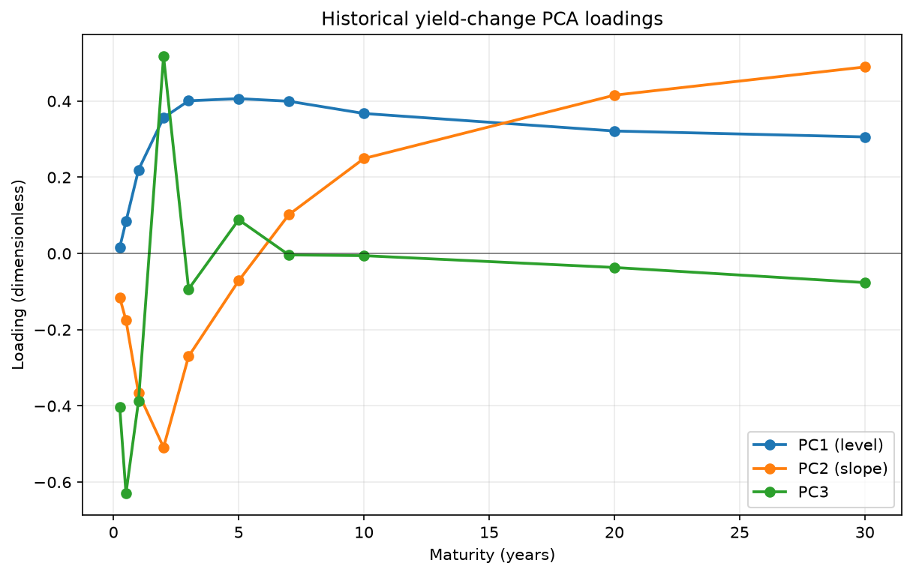
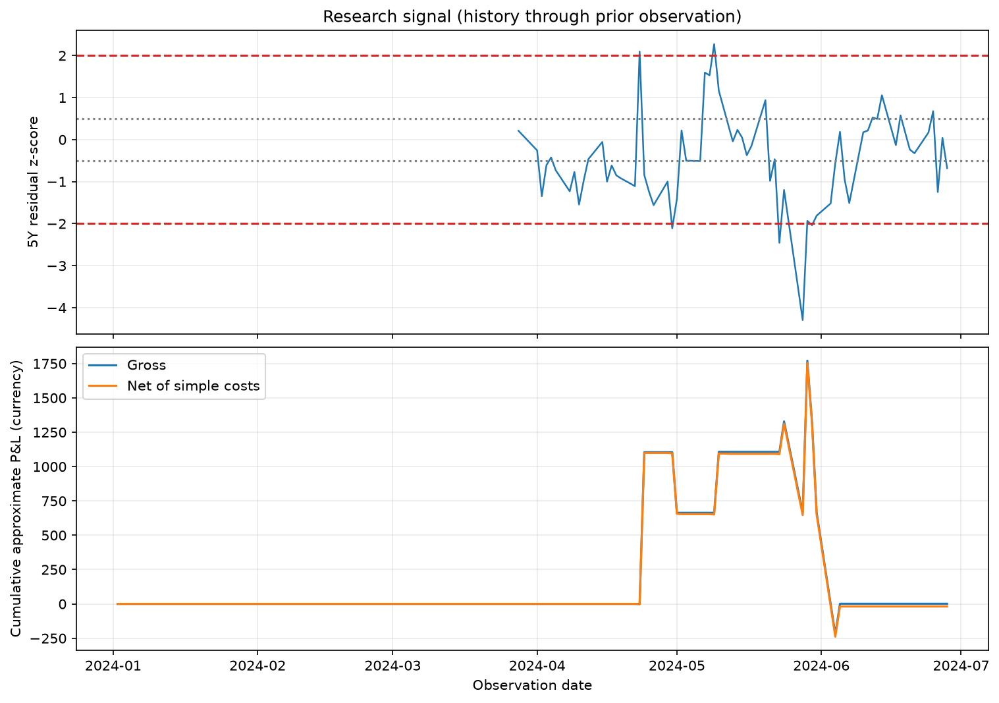

# Fixed-Income Yield Curve & Relative-Value Engine

[](https://github.com/REMEDIOSSAMUEL/fixed-income-yield-curve-engine/actions/workflows/tests.yml)

## Overview

This repository is a transparent Python research engine for nominal fixed-rate
bond analytics, yield-curve modelling, interest-rate risk, empirical curve
factors, and relative-value analysis. The important financial mathematics is
implemented directly with NumPy, pandas, and SciPy rather than delegated to an
opaque finance library.

The bundled dataset contains 124 daily U.S. Treasury constant-maturity yield
(CMT) observations from 2 January to 28 June 2024 across tenors from 3M to 30Y.
Published percentage values are converted once to decimal annual rates on load;
internally, 4.25% is `0.0425` and 1 bp is exactly `0.0001`.

CMT observations retain their source meaning throughout the empirical analysis.
They are par-yield-like statistical series, not security prices or an
automatically bootstrapped zero-coupon curve. Conventional YTM pricing and
spot-curve discounting are separate, explicitly labelled APIs.

## Features

- Regular annual and semiannual fixed-rate bond schedules and cash flows
- Actual/Actual coupon-period accrual with separate clean, dirty, and accrued
  amounts
- YTM inversion, Macaulay and modified duration, convexity, and analytical DV01
- Tagged CMT, par-yield, zero-rate, fitted-curve, and discount-factor
  representations
- Continuous, periodic, and simple-compounding discount factors
- Nelson-Siegel-Svensson (NSS) evaluation and bounded deterministic multi-start
  calibration
- Parallel and shaped full-revaluation curve shocks and key-rate DV01
- Covariance or correlation PCA of historical yield changes
- Fitted-curve residuals, lagged rolling z-scores, and rich/cheap rankings
- Raw and DV01-neutral 2s5s10s butterfly analytics
- A dated, lagged relative-value sensitivity backtest with explicit turnover and
  transaction-cost accounting
- Optional FRED/H.15 retrieval with a packaged offline fallback
- Deterministic charts, CSV reports, and JSON metadata under `outputs/`

## Example Analysis

The following results come from the full bundled sample and the default command:

```bash
python fixed_income_engine.py demo --offline
```

They are included to make the repository reproducible, not to select an
attractive period.

| Analysis | Reproduced offline result |
|---|---:|
| Latest observation | 2024-06-28 |
| Latest NSS fit RMSE | 1.2943 bp |
| NSS scaled-Jacobian condition number | 3.07e8 |
| Representative bond clean / dirty price | 99.127657 / 100.161127 currency |
| Representative bond modified duration | 7.826439 years |
| Representative bond DV01 | 0.078390 currency/bp per 100 face |
| PCA variance explained by PC1 / PC2 / PC3 | 90.502% / 6.558% / 0.921% |
| Latest 5Y observed-minus-fitted residual | +0.148 bp |
| Raw 2s5s10s yield butterfly | -41.000 bp |
| Historical NSS calibrations | 124 converged, 0 failed |
| Default gross / net approximate backtest P&L | 1.26465 / -18.37072 currency |

The large NSS condition number is reported alongside the low cross-sectional
RMSE because a close fit does not imply stable or economically identified NSS
parameters.



## Bond Mathematics

For face value \(F\), decimal annual coupon rate \(c\), and \(m\) payments per
year, each regular coupon is \(C=Fc/m\). With future cash flow \(CF_i\) and
fractional coupon-period count \(q_i\), conventional nominal-YTM dirty price is

$$
P_{\mathrm{dirty}}(y)=\sum_i CF_i\left(1+\frac{y}{m}\right)^{-q_i},
\qquad
P_{\mathrm{clean}}=P_{\mathrm{dirty}}-AI.
$$

Accrued interest \(AI\) uses the actual elapsed days divided by the actual days
in the surrounding regular coupon period. Settlement-date payments are
excluded. The implementation supports regular schedules only; it does not add
holiday adjustment, settlement lag, stubs, or ex-coupon rules.

Macaulay duration uses the same discount exponents as pricing. For
\(t_i=q_i/m\) years,

$$
D_{\mathrm{Mac}}=\frac{\sum_i t_i\,PV(CF_i)}{P_{\mathrm{dirty}}},
\qquad
D_{\mathrm{mod}}=\frac{D_{\mathrm{Mac}}}{1+y/m}.
$$

Modified duration gives
\(\Delta P/P\approx-D_{\mathrm{mod}}\Delta y\). Positive long-bond DV01 is

$$
\mathrm{DV01}=-\frac{\partial P}{\partial y}\times 0.0001
\approx\frac{P(y-0.0001)-P(y+0.0001)}{2}.
$$

Analytical duration, convexity, and DV01 are independently checked against
central finite differences in the test suite.

## Yield-Curve Modelling

`YieldCurve` requires a financial representation tag. Only `ZERO_RATE` and
`FITTED_ZERO_RATE` curves can discount cash flows; a CMT curve cannot be passed
silently to a pricing function. For a zero rate \(z(t)\), examples of the
implemented discount conventions are

$$
D_{\mathrm{continuous}}(t)=e^{-z(t)t},
\qquad
D_{\mathrm{periodic}}(t)=\left(1+\frac{z(t)}{m}\right)^{-mt}.
$$

Spot-curve valuation discounts each payment separately,
\(P=\sum_i CF_iD(t_i)\). Zero rates are linearly interpolated across maturity.
Extrapolation is rejected by default; callers can explicitly request flat
endpoint rates. The demo's curve-risk workflow makes a labelled illustrative
assumption by copying CMT nodes into a continuously compounded zero-rate proxy.
That proxy is not used for the NSS, PCA, or relative-value interpretation.

## Nelson-Siegel-Svensson

For maturity \(t\) and decay constants \(\tau_1,\tau_2>0\), define

$$
L_1(t,\tau)=\frac{1-e^{-t/\tau}}{t/\tau},
\qquad
L_2(t,\tau)=L_1(t,\tau)-e^{-t/\tau}.
$$

The fitted curve is

$$
y(t)=\beta_0+\beta_1L_1(t,\tau_1)
+\beta_2L_2(t,\tau_1)+\beta_3L_2(t,\tau_2).
$$

Betas and fitted yields are decimal annual rates; maturities and taus are years.
Calibration uses bounded nonlinear least squares, deterministic starts,
explicit analytical Jacobians, stable short-maturity limits, and diagnostics
for loading/Jacobian conditioning and active bounds. Fitting CMT observations
produces a smooth fitted CMT curve, not discount factors.

## Curve Risk

Curve risk is calculated by full repricing of an explicitly tagged zero curve.
The engine supports parallel shocks, a parameterized steepener/flattener, and
piecewise-linear 2Y/5Y/10Y/30Y key-rate bumps. A positive shock raises rates;
long fixed-rate bond prices normally fall.

Key-rate DV01 uses symmetric localized bumps and reports positive currency risk
per bp. The key-rate hats partition a parallel shock, so their sum converges to
parallel DV01 in the first-derivative limit. Finite-bump reconciliation remains
approximate because of higher-order terms.

## PCA of Yield Changes

PCA is applied to adjacent-observation yield changes, not levels. If
\(\Delta Y_t=Y_t-Y_{t-1}\) and \(X\) is the centered change matrix, covariance
PCA computes

$$
\Sigma=\frac{X^\top X}{n-1},
\qquad
\Sigma V=V\Lambda,
\qquad
S=XV.
$$

Loadings \(V\) are dimensionless, covariance-PCA scores \(S\) are decimal yield
changes, and eigenvalues are squared decimal changes. Signs are normalized
deterministically. Level, slope, and curvature labels are assigned only when
quantitative loading-shape diagnostics support them. In the bundled sample, PC1
is classified as level, PC2 as slope, and PC3 is left unlabelled because its
shape is ambiguous.



## Relative-Value Analysis

For tenor \(m\), the cross-sectional fitted-curve residual is

$$
r_{t,m}=y^{\mathrm{observed}}_{t,m}-y^{\mathrm{fitted}}_{t,m}.
$$

A positive residual is high in yield relative to the fit and is labelled
`cheap`; a negative residual is labelled `rich`. These are relative yield-space
descriptions, not executable mispricing or arbitrage claims.

Historical normalization excludes the current row:

$$
z_{t,m}=\frac{r_{t,m}-\mu_{t-1,w,m}}{\sigma_{t-1,w,m}},
$$

where the mean and sample standard deviation use at most the preceding \(w\)
observations. Missing values are not filled. A positive z-score means above the
residual's trailing mean and does not necessarily mean the raw residual itself
is positive.

## 2s5s10s DV01-Neutral Butterfly

The quoted raw yield butterfly is

$$
B_t=2y_{5,t}-y_{2,t}-y_{10,t}.
$$

This equal-yield-weight measure is separate from trade sizing. With positive
unit DV01s \(d_2,d_5,d_{10}\), a normalized long-belly structure sets

$$
N_2=-\frac{1}{2}N_5\frac{d_5}{d_2},
\qquad
N_{10}=-\frac{1}{2}N_5\frac{d_5}{d_{10}},
\qquad
N_2d_2+N_5d_5+N_{10}d_{10}=0.
$$

On 28 June 2024, a long 1,000,000 face 5Y proxy produces short notionals of
1,179,493.10 in the 2Y wing and 277,069.66 in the 10Y wing. Each wing offsets
222.638260 currency/bp of the belly's 445.276520 currency/bp, giving zero
first-order parallel DV01 to displayed precision. This does not neutralize
curve shape, convexity, carry, roll, liquidity, or basis risk.

## Historical Backtest

The research backtest uses the 5Y observed-minus-NSS-fitted residual. Each date
is calibrated independently with the same deterministic multi-start procedure.
The default signal uses 60 preceding observations, a \(\pm2.0\) entry threshold,
and directional exits at \(\pm0.5\). No parameters are selected by optimizing
P&L on the sample.

The event order is explicit:

1. Positions decided on \(t-1\) earn first-order P&L from yield changes between
   \(t-1\) and \(t\), using the \(t-1\) notionals and unit DV01s.
2. The \(t\) residual is standardized using history through \(t-1\).
3. The signal sets a new DV01-neutral target; transaction costs are charged on
   the absolute change in face notional.
4. The target is held over \(t\) to \(t+1\). The final target is liquidated.

For leg \(i\), the approximate interval P&L is

$$
\mathrm{PnL}_t\approx-\sum_i N_{i,t-1}d_{i,t-1}\Delta y_{i,t}^{\mathrm{bp}},
$$

and the one-way cost model is
\(\sum_i|N_{i,t}-N_{i,t-1}|\,c_{\mathrm{bp}}\times0.0001\).

The complete default offline sample gives:

| Metric | Gross | Net of simple costs |
|---|---:|---:|
| Approximate cumulative P&L (currency) | 1.26465 | -18.37072 |
| Maximum drawdown (currency) | 1,992.31172 | 1,992.31928 |
| Active-interval hit rate | 46.15% | 38.46% |
| Entries | 4 | 4 |
| Time in market | 10.57% | 10.57% |

The default 0.01 bp-of-face assumption charges 19.63538 currency on
19,635,377.73 of absolute face turnover. These values are accounting outputs
from a short first-order sensitivity study. No capital denominator is defined,
so the engine does not present them as percentage returns.



## Installation

Python 3.11 or newer is required. Create and activate a virtual environment,
then install the package with development dependencies:

```bash
python -m venv .venv
# Linux/macOS: source .venv/bin/activate
# Windows PowerShell: .venv\Scripts\Activate.ps1
python -m pip install --upgrade pip
python -m pip install -e ".[dev]"
```

The runtime dependencies are NumPy, pandas, SciPy, and Matplotlib. Tests use the
packaged offline sample and block network connections.

## Usage

The modules can be imported independently. This example prices a regular bond
with a conventional nominal annual YTM in decimal units:

```python
from datetime import date

from fixed_income.bonds import FixedRateBond, PriceType, dv01, price_from_ytm

bond = FixedRateBond(
    accrual_start_date=date(2020, 3, 31),
    maturity_date=date(2034, 3, 31),
    coupon_rate=0.0425,
    face_value=100.0,
    frequency=2,
)
settlement = date(2024, 6, 28)
ytm = 0.0436

dirty_price = price_from_ytm(bond, settlement, ytm, price_type=PriceType.DIRTY)
currency_dv01_per_bp = dv01(bond, settlement, ytm)
```

Use `fixed_income.risk.price_from_curve` for spot-curve discounting; it requires
an explicitly tagged zero-rate curve and an explicit clean/dirty price basis.

## Example CLI Commands

```bash
python fixed_income_engine.py --help
python fixed_income_engine.py demo --offline
python fixed_income_engine.py curve --offline
python fixed_income_engine.py bond
python fixed_income_engine.py risk --offline
python fixed_income_engine.py pca --offline
python fixed_income_engine.py relative-value --offline
python fixed_income_engine.py backtest --offline
python fixed_income_engine.py backtest --offline --lookback 40 --entry-z 1.75 \
  --exit-z 0.25 --transaction-cost-bp 0.02
```

Add `--offline` to every market-data command to guarantee that no network
request is attempted.

## Output Files

Generated program output is written to `outputs/`, which is gitignored:

| File | Contents |
|---|---|
| `yield_curve.png` | Latest observed CMT cross-section and NSS fit |
| `pca_loadings.png` | Leading historical yield-change PCA loadings |
| `bond_risk_report.csv` | Parallel and shaped full-revaluation scenarios |
| `key_rate_dv01.csv` | 2Y/5Y/10Y/30Y localized curve risk |
| `relative_value_report.csv` | Current residual ranking and classification |
| `nss_calibration_diagnostics.csv` | Dated fit status, parameters, RMSE, and conditioning |
| `rv_backtest.csv` | Full dated signal, position, P&L, cost, and exposure ledger |
| `rv_backtest_metrics.csv` | Gross and net summary metrics |
| `rv_backtest_metadata.json` | Configuration, timing, provenance, and limitations |
| `transaction_cost_sensitivity.csv` | Net metrics across cost assumptions |
| `rv_backtest.png` | Lagged signal and cumulative approximate P&L |

Stable copies of the three representative charts are tracked under
`docs/assets/` so they render on GitHub. Regenerate source outputs with
`python fixed_income_engine.py demo --offline` before updating those copies.

## Project Structure

```text
fixed_income/
  bonds.py              schedules, YTM pricing, duration, convexity, DV01
  curves.py             tagged curves, discounting, and NSS calibration
  data.py               FRED adapter, validation, and offline fallback
  risk.py               curve pricing, scenarios, and key-rate DV01
  pca.py                yield-change PCA and loading diagnostics
  relative_value.py     residuals, z-scores, rankings, and butterfly sizing
  backtest.py           signal timing, hedge sizing, P&L, and costs
  plotting.py           deterministic analytical figures
  workflows.py          CLI orchestration and artifact generation
  sample_data/          packaged offline Treasury CMT snapshot
fixed_income_engine.py  command-line entry point
tests/                  offline unit, numerical identity, and CLI tests
docs/assets/            stable README charts
outputs/                generated, gitignored run artifacts
PROJECT_SPEC.md         mathematical and validation specification
docs/AUDIT.md           numerical and methodology audit record
```

## Testing

Run the same core checks used by CI:

```bash
pytest -q
ruff check .
python fixed_income_engine.py demo --offline
```

The suite includes analytical identities, independent finite differences,
synthetic PCA recovery, exact backtest ledger checks, future-data mutation tests,
offline CLI smoke tests, and validation failures for ambiguous units and curve
representations. GitHub Actions installs `.[dev]` and runs Ruff and pytest on
pushes and pull requests.

## Methodological Limitations

- **Constant-maturity yields versus tradable securities.** Treasury CMTs are
  interpolated par-curve statistics. They do not identify a particular bond,
  cash price, financing instrument, or executable bid/ask quote. Proxy bonds
  used for DV01 sizing are hypothetical.
- **Fitted curve versus zero-curve bootstrapping.** NSS smooths the input yield
  series and does not solve discount factors from security cash flows. The
  curve-risk demo's direct CMT-to-zero mapping is an explicit illustration, not
  exact bootstrapping. Linear zero-rate interpolation does not ensure monotone
  discount factors or non-negative forward rates.
- **Bond conventions.** The implementation covers regular annual and
  semiannual bullet schedules with Actual/Actual coupon-period accrual. It omits
  business-day calendars, settlement lags, irregular coupons, ex-coupon rules,
  and Treasury-specific final-period conventions.
- **Execution assumptions.** A signal observed at date \(t\) is assumed to set
  the target held from \(t\) to \(t+1\). Publication timestamps and executable
  subsequent prices are unavailable, so same-observation target execution is
  hypothetical.
- **Transaction costs.** Costs are a configurable linear number of basis points
  of absolute face traded. They are charged on entries, exits, reversals, daily
  hedge resizing, and final liquidation. The model does not use historical
  security-level bid/ask spreads, slippage, or market impact.
- **Financing assumptions.** Financing, funding spreads, coupon carry, repo,
  roll-down, futures basis, margin, taxes, and cash balances are omitted. Daily
  proxy hedge resizing is not a self-financing tradable portfolio.
- **Backtest scope.** The packaged sample is only 124 observations in one
  six-month 2024 regime and was retrieved later rather than preserved as a
  real-time vintage. Revision history, publication delays, security selection,
  survivorship, unequal calendar gaps, parameter stability, and out-of-sample
  robustness are not established.
- **P&L approximation.** Backtest P&L is first-order DV01 times yield change. It
  omits full security repricing, convexity, aging, and changing deliverables.
  Annualized statistics assume 252 equally weighted observation intervals and
  do not correct for serial correlation.
- **Historical evidence.** The reproduced historical figures are diagnostics
  for this implementation and sample. They are not live results, evidence of
  future profitability, or evidence of an executable trading edge.
- **Model risk.** NSS is non-convex and can be weakly identified. Deterministic
  multi-start calibration and condition diagnostics reduce numerical ambiguity
  but do not establish a global optimum or stable economic parameter meaning.

See [PROJECT_SPEC.md](PROJECT_SPEC.md) for the full mathematical specification
and [docs/AUDIT.md](docs/AUDIT.md) for the internal numerical and methodology
audit.

Released under the [MIT License](LICENSE).
